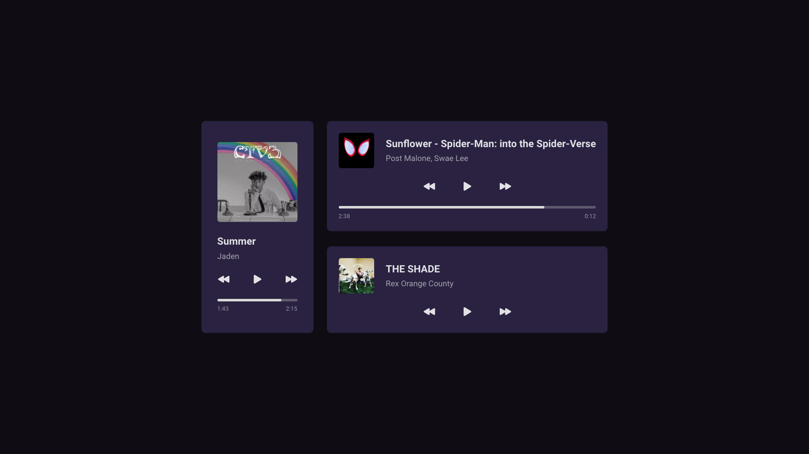

# PlayerMusic
<h1 align="center"> Player Music </h1>

Programa exclusivo e gratuito, promovido pela Rocketseat para ensino de tecnologias WEB.  
<a href="https://www.youtube.com/watch?v=M_eaBcany6Y&list=WL&index=15">Estude esse projeto em formato de vídeo clicando aqui.</a>

  <a href="#-tecnologias">Tecnologias</a>&nbsp;&nbsp;&nbsp;|&nbsp;&nbsp;&nbsp;
  <a href="#-projeto">Projeto</a>&nbsp;&nbsp;&nbsp;|&nbsp;&nbsp;&nbsp;
  <a href="#-layout">Layout</a>&nbsp;&nbsp;&nbsp;|&nbsp;&nbsp;&nbsp;
  <a href="#memo-licença">Licença</a>

 

  

## 🚀 Tecnologias

Esse projeto foi desenvolvido com as seguintes tecnologias:

- HTML e CSS

## 💻 Projeto

O #boraCodar, um convite em forma de desafio para você apostar na sua evolução em programação. 

- [Acesse o projeto finalizado, online](https://github.com/matheussouza-ap/Player-Music)

- [Assista a aula](https://www.youtube.com/watch?v=M_eaBcany6Y&list=WL&index=15)

## 🔖 Layout

Você pode visualizar o layout do projeto através [DESSE LINK](https://www.figma.com/community/file/1195050524500542670). É necessário ter conta no [Figma](https://figma.com) para acessá-lo.

---

Feito com ♥ by Matheus :wave: [Linkedin!](https://www.linkedin.com/in/matheus-a-souza-329688199/)